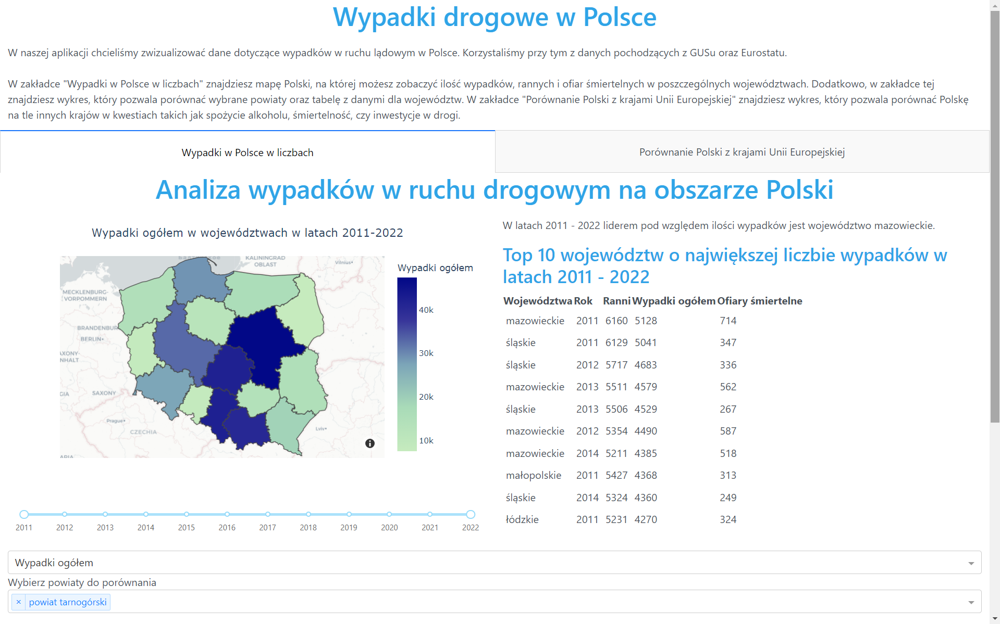
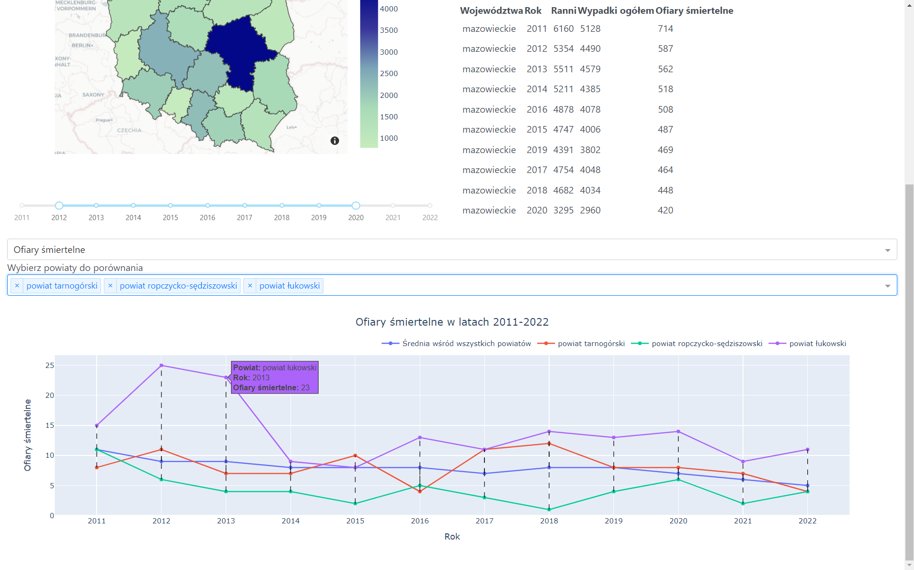
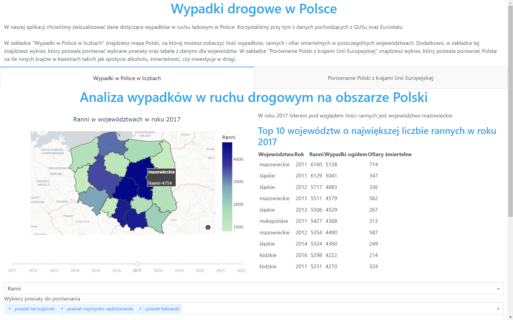
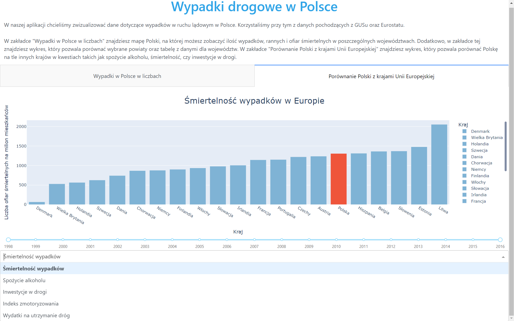
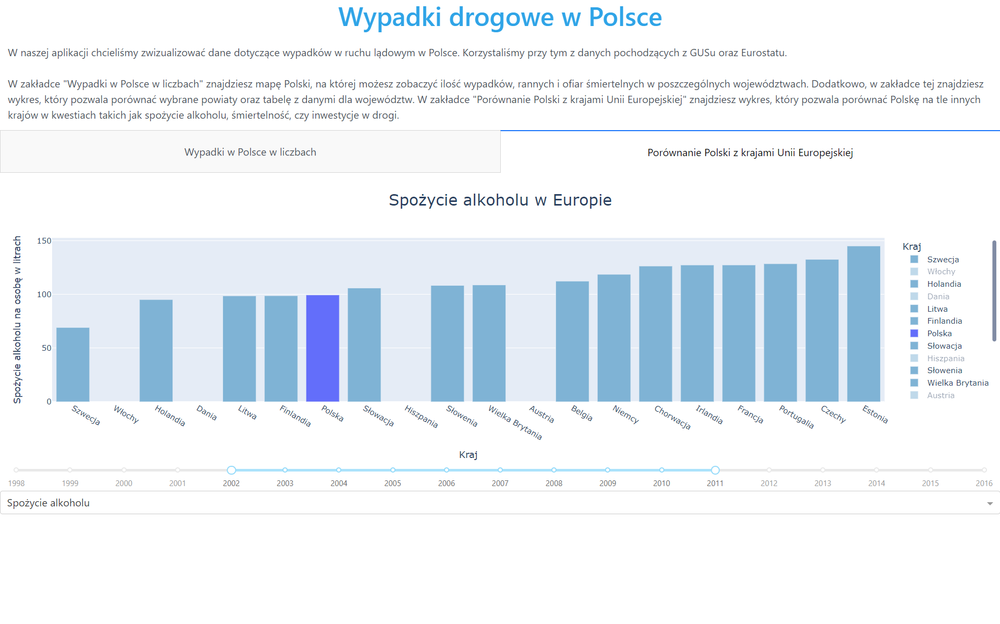

#### Road accidents in Poland - dashboard

Project done by Krzysztof Krawiec, Fanciszek Saliński and Bartosz Szymański, as a part of the course "Exploratory Data Analysis" at Warsaw University of Technology.

#### Used technology
- pytohn
- dash
- pandas
- plotly
- numpy
  
#### About project

We have created an application that visualizes and allows for the analysis of road accident data in Poland. It consists of two main parts. One of them includes a map and charts that depict the numbers of accidents and casualties in various voivodeships and counties. The second part compares Poland with other EU countries in terms of accident mortality rates, road investments, and alcohol consumption, among other factors.

### The final result

